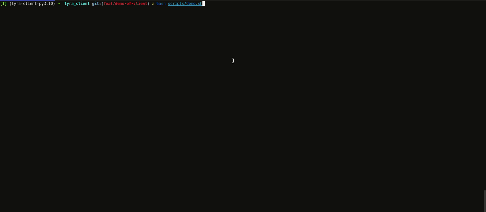

# Lyra V2 Python Client.

This repo provides a unified interface for the Lyra V2 Exchange.

Please checkout the [examples](./examples) directory for usage.

Here is a quick demonstration of the cli functionality.



## Install

```bash
pip install lyra-v2-client
```

## Dev

### Formatting

```bash
make fmt
```

### Linting

```bash
make lint
```

### Tests

```bash
make tests
```

For convience, all commands can be run with:

```
make all
```

### Releasing

We can use `tbump` to automatically bump our versions in preparation of a release.

```bash 
export new_version=0.1.5
tbump $new_version
```

The release workflow will then detect that a branch with a `v` prefix exists and create a release from it.

Additionally, the package will be published to PyPI.
